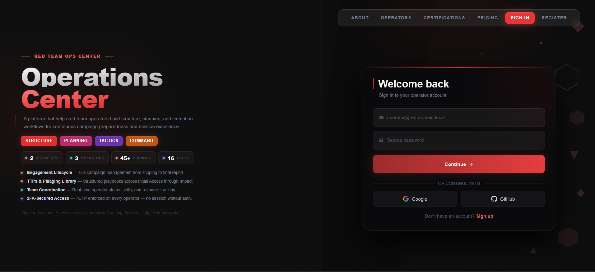
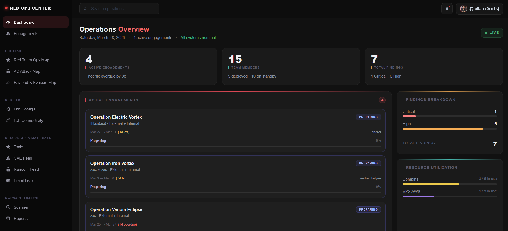
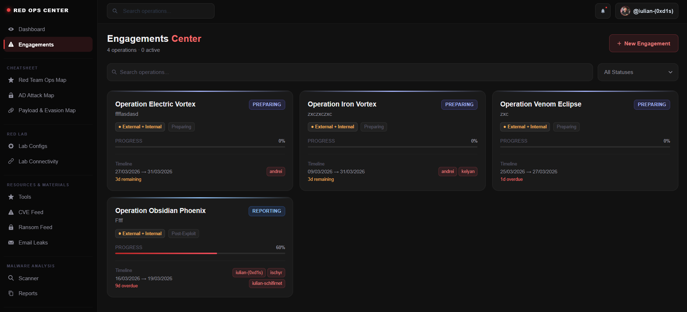
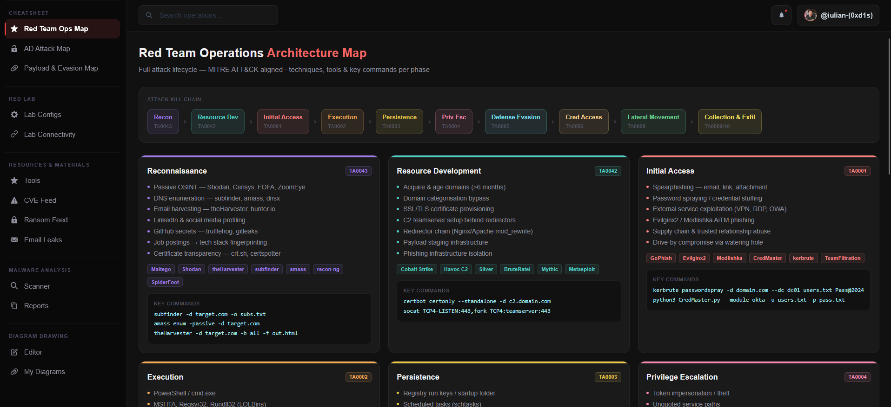
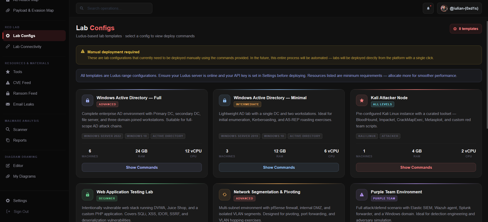
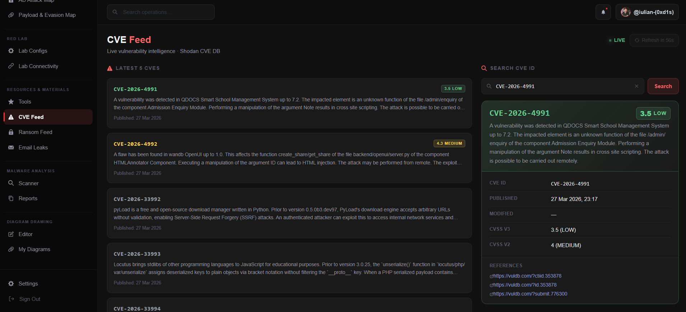
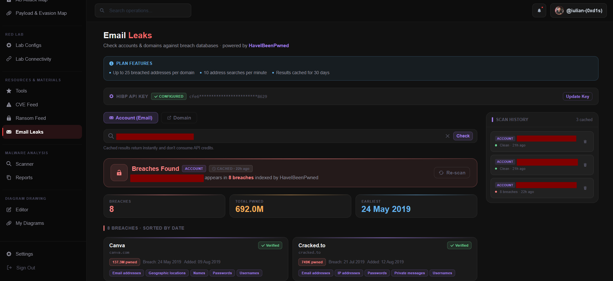
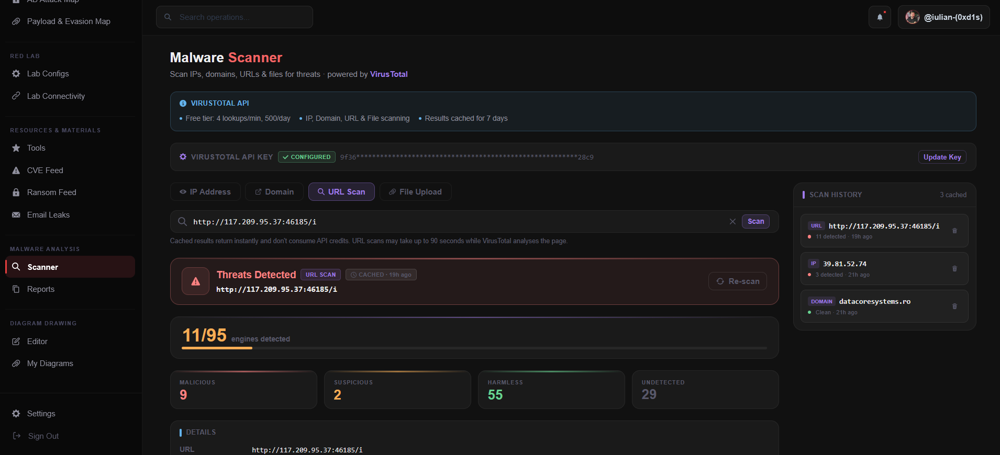

# Red Team Operations Center

A platform that helps red team operators build structure, planning, and execution workflows for continuous campaign preparedness and mission excellence.

---

## Running the App

**Terminal 1 — Backend:**
```bash
cd server
npm run dev
```

**Terminal 2 — Frontend:**
```bash
npm start
```

> Make sure MongoDB is running locally on port `27017` before starting the server.

---

## Platform Screenshots

### Landing Page


### Operations Dashboard


### Engagements Center


### Cheatsheet — Payload & Evasion Map


### Lab Configs


### CVE Feed


### Email Leaks


### Malware Scanner


---

## Dashboard

### Layout

The dashboard uses a persistent full-screen layout with a fixed left sidebar and a scrollable content area:

```
┌─────────────┬──────────────────────────────────────────┐
│             │  TopBar (@callsign · search · bell)       │
│   Sidebar   ├──────────────────────────────────────────┤
│             │                                          │
│  CHEATSHEET │           Active View                    │
│  RED LAB    │    (DashboardView / PlaceholderView)     │
│  RESOURCES  │                                          │
│  MALWARE    │                                          │
│  DIAGRAMS   │                                          │
│  ─────────  │                                          │
│  [per-eng]  │                                          │
│             │                                          │
│  Settings   │                                          │
│  Sign Out   │                                          │
└─────────────┴──────────────────────────────────────────┘
```

### Sidebar Navigation

**Global sections (always visible):**

| Section | Items |
|---|---|
| *(top)* | Dashboard, Engagements |
| **CHEATSHEET** | Red Team Ops Map, AD Attack Map, Payload & Evasion Map |
| **RED LAB** | Lab Configs, Lab Connectivity |
| **RESOURCES & MATERIALS** | Tools, CVE Feed |
| **MALWARE ANALYSIS** | Scanner, Reports |
| **DIAGRAM DRAWING** | Editor, My Diagrams |

**Per-engagement sections (shown when inside an engagement):**

| Section | Items |
|---|---|
| **OPERATIONS** | Activity Log, Calendar, Skill Requests, TTX Planner, Campaign Builder |
| **TEAM** | People & Skills, Resources |
| **INTELLIGENCE** | Loot Tracker, Evidence Vault, Cleanup Tracker, C2 Infrastructure, Phishing Infrastructure |
| **SOCK PUPPETS** | Personas, Social Media |
| **TTPs** | Initial Access, Windows, Linux, Active Directory, Network |
| **PILLAGING** | Subdomains, Services, Leaks, Credentials, Emails, Documents |
| **REPORTING** | Reports, Findings, Client Portal |

- Active item is highlighted with a red left border + red tinted background
- Section labels are uppercase in muted gray
- Brand mark "Red Ops Center" with pulsing red dot at top
- Settings + Sign Out always pinned at the bottom

### TopBar

- **Search** — operations search input (left)
- **Bell** — notification icon with red dot indicator (right)
- **@callsign chip** — shows the logged-in operator's callsign with avatar initial (right)

### Dashboard Overview (`/dashboard`)

**Stat Cards (top row):**

| Card | Value | Accent |
|---|---|---|
| Active Engagements | Live count | Red gradient |
| Team Members | Live count | Teal gradient |
| Total Findings | Live count | Orange/yellow gradient |
| Active Beacons | Live count | Green gradient |

**Active Engagements panel** — shows up to 3 cards at a time (fixed 504px height), paginated:
- Operation name + client + scope
- Started / Ends dates · Operators · Current phase
- Overall progress bar (color varies by status)
- Status badge: `IN PROGRESS` · `REPORTING` · `PLANNING` · `COMPLETED`
- Severity badges: `CRITICAL` · `HIGH` · `MED` · `LOW`

**Findings Breakdown panel** — horizontal bars per severity (Critical / High / Medium / Low) + total count

**Resource Utilization panel** — top 5 by usage ratio, progress bars with footer total count

**Recent Activity feed** — timestamped events with colored dot indicators per type

**Team Skill Coverage** — skill bars with color thresholds (green ≥80% · yellow ≥65% · orange <65%)

### Dashboard Routes

All routes under `/dashboard/*` are protected — unauthenticated users are redirected to `/signin`.

**Global routes:**

| Path | View | Status |
|---|---|---|
| `/dashboard` | Operations Overview | Built |
| `/dashboard/engagements` | Engagements List | Built |
| `/dashboard/settings` | Settings | Built |
| `/dashboard/cheatsheet/red-team-map` | Red Team Ops Map | Built |
| `/dashboard/cheatsheet/ad-map` | AD Attack Map | Built |
| `/dashboard/cheatsheet/payload-map` | Payload & Evasion Map | Built |
| `/dashboard/lab/configs` | Lab Configs | Built |
| `/dashboard/lab/connectivity` | Lab Connectivity (Twingate) | Built |
| `/dashboard/resources/tools` | Tools | Placeholder |
| `/dashboard/resources/cve-feed` | CVE Feed | Built |
| `/dashboard/malware/scanner` | Malware Scanner | Placeholder |
| `/dashboard/malware/reports` | Analysis Reports | Placeholder |
| `/dashboard/diagrams/editor` | Diagram Editor (draw.io embed) | Built |
| `/dashboard/diagrams/library` | My Diagrams | Built |

**Per-engagement routes (under `/:slug/*`):**

| Path | View | Status |
|---|---|---|
| `/:slug` | Engagement Detail | Built |
| `/:slug/operations/activity` | Activity Log | Built |
| `/:slug/operations/calendar` | Calendar | Placeholder |
| `/:slug/operations/skill-requests` | Skill Requests | Placeholder |
| `/:slug/operations/ttx` | TTX Planner | Placeholder |
| `/:slug/operations/campaign` | Campaign Builder | Placeholder |
| `/:slug/team/people` | People & Skills | Built |
| `/:slug/team/resources` | Resources | Built |
| `/:slug/intelligence/loot-tracker` | Loot Tracker | Placeholder |
| `/:slug/intelligence/evidence-vault` | Evidence Vault | Placeholder |
| `/:slug/intelligence/cleanup-tracker` | Cleanup Tracker | Placeholder |
| `/:slug/intelligence/c2` | C2 Infrastructure | Placeholder |
| `/:slug/intelligence/phishing` | Phishing Infrastructure | Placeholder |
| `/:slug/sockpuppets/personas` | Personas | Placeholder |
| `/:slug/sockpuppets/social-media` | Social Media | Placeholder |
| `/:slug/ttps/*` | TTPs (5 pages) | Placeholder |
| `/:slug/pillaging/*` | Pillaging (6 pages) | Placeholder |
| `/:slug/reporting/reports` | Reports | Placeholder |
| `/:slug/reporting/findings` | Findings | Built |
| `/:slug/reporting/findings/:id` | Finding Detail | Built |
| `/:slug/reporting/client-portal` | Client Portal | Placeholder |

### Dashboard File Structure

```
src/components/dashboard/
├── DashboardLayout.js              # Full-screen layout — sidebar + topbar + nested routes
├── EngagementLayout.js             # Per-engagement route wrapper
├── Sidebar.js                      # Left nav — global + per-engagement sections
├── TopBar.js                       # Search + notifications + @callsign chip
├── views/
│   ├── DashboardView.js            # Operations Overview — stat cards + all widgets
│   ├── PlaceholderView.js          # Reusable "under construction" view
│   ├── EngagementsView.js          # Engagements list + create
│   ├── EngagementDetailView.js     # Single engagement overview
│   ├── SettingsView.js             # User settings (profile, password, compact mode)
│   ├── RedTeamMapView.js           # Cheatsheet — Red Team Ops Map
│   ├── ADAttackMapView.js          # Cheatsheet — AD Attack Map
│   ├── PayloadMapView.js           # Cheatsheet — Payload & Evasion Map
│   ├── LabConfigsView.js           # Red Lab — Ludus template cards + deploy modal
│   ├── LabConnectivityView.js      # Red Lab — Twingate VPN walkthrough
│   ├── CVEFeedView.js              # Resources — live CVE feed + CVE ID search
│   ├── DiagramEditorView.js        # Diagrams — draw.io embed with save to DB
│   ├── DiagramLibraryView.js       # Diagrams — grid of saved diagrams
│   ├── PeopleSkillsView.js         # Team — operator list + skill assignment
│   ├── ResourcesView.js            # Team — resource tracking
│   ├── ActivityView.js             # Operations — activity log
│   ├── FindingsView.js             # Reporting — findings list
│   └── FindingDetailView.js        # Reporting — single finding detail
└── widgets/
    ├── StatCard.js                 # Colored-accent stat card
    ├── EngagementCard.js           # Individual operation card with progress + findings
    ├── ActiveEngagements.js        # Fixed-height paginated panel of EngagementCards
    ├── FindingsBreakdown.js        # Severity bar chart + total count
    ├── ResourceUtilization.js      # Top-5 resource bars by usage ratio
    ├── RecentActivity.js           # Timestamped activity feed with colored dots
    └── TeamSkillCoverage.js        # Skill coverage bars with color thresholds
```

---

## Project Structure

```
red-team-operations-center/
├── docs/                               # Documentation assets (screenshots etc.)
├── server/                             # Node.js + Express backend
│   ├── index.js                        # Entry point — CORS, session, passport, route mounts
│   ├── .env                            # Environment variables (never commit)
│   ├── config/
│   │   ├── db.js                       # Mongoose connection to MongoDB
│   │   └── passport.js                 # Passport Google + GitHub OAuth strategies
│   ├── models/
│   │   ├── User.js                     # User schema — callsign, email, password, OAuth fields
│   │   ├── Engagement.js               # Engagement schema — full op data + operator skills
│   │   └── Diagram.js                  # Diagram schema — name, XML, thumbnail, owner
│   ├── controllers/
│   │   ├── authController.js           # register(), login(), 2FA business logic
│   │   ├── engagementController.js     # Engagement CRUD
│   │   └── userController.js           # Profile + password update
│   ├── routes/
│   │   ├── auth.js                     # /api/auth/* — register, login, 2FA
│   │   ├── oauth.js                    # /api/oauth/* — Google + GitHub OAuth
│   │   ├── engagements.js              # /api/engagements/* — CRUD
│   │   ├── users.js                    # /api/users/* — profile
│   │   ├── cve.js                      # /api/cve/* — Shodan CVE DB proxy
│   │   └── diagrams.js                 # /api/diagrams/* — diagram CRUD
│   ├── middleware/
│   │   ├── validate.js                 # express-validator input rules per route
│   │   └── authMiddleware.js           # protect() — JWT verification
│   └── utils/
│       └── token.js                    # signToken(), verifyToken(), temp token helpers
│
└── src/                                # React frontend
    ├── App.js                          # ChakraProvider + AnimatePresence + Routes
    ├── theme.js                        # Chakra UI dark theme (Inter font, #111111 bg)
    ├── index.js                        # React DOM entry point
    ├── styles/
    │   └── cardStyles.js               # Shared commonCard style object
    ├── contexts/
    │   ├── AuthContext.js              # Auth state — login, register, 2FA, OAuth, JWT
    │   ├── SettingsContext.js          # User settings (compact mode etc.)
    │   └── EngagementContext.js        # Engagement state + dashboard stats
    └── components/
        ├── common/
        │   ├── Navigation.js           # Frosted-glass nav bar, route-aware active state
        │   ├── PageLayout.js           # Shared wrapper for static pages
        │   └── SparkleQuote.js         # Hover sparkle animation component
        ├── auth/
        │   ├── AuthForm.js             # Sign in / Register form + Google/GitHub OAuth buttons
        │   └── OAuthCallback.js        # Handles OAuth redirect — stores token, enters dashboard
        ├── dashboard/
        │   ├── DashboardLayout.js
        │   ├── EngagementLayout.js
        │   ├── Sidebar.js
        │   ├── TopBar.js
        │   ├── views/                  # (see Dashboard File Structure above)
        │   └── widgets/
        └── pages/
            ├── LandingLayout.js
            ├── LandingHero.js
            ├── LandingShapes.js
            ├── About.js
            ├── Operators.js
            ├── Certifications.js
            ├── about/
            ├── operators/
            └── certifications/
```

---

## Routes

### Frontend (Public)

| Path | Component | Auth required |
|---|---|---|
| `/` | Redirects based on auth state | — |
| `/signin` | `LandingLayout` + `AuthForm` | No |
| `/register` | `LandingLayout` + `AuthForm` | No |
| `/oauth/callback` | `OAuthCallback` | No |
| `/about` | `About` | No |
| `/operators` | `Operators` | No |
| `/certifications` | `Certifications` | No |
| `/dashboard/*` | `DashboardLayout` | **Yes** |

- Logged-in users visiting `/signin` or `/register` are redirected to `/dashboard`
- Unauthenticated users visiting any `/dashboard/*` route are redirected to `/signin`
- OAuth callback (`/oauth/callback`) reads `?token=&user=` params, stores in localStorage, enters dashboard

### Backend API

**Auth**

| Method | Endpoint | Body | Description |
|---|---|---|---|
| POST | `/api/auth/register` | `callsign, email, password` | Create operator, returns QR for 2FA setup |
| POST | `/api/auth/confirm-2fa-setup` | `email, token` | Confirm first OTP, activates 2FA, returns JWT |
| POST | `/api/auth/login` | `email, password` | Login — returns `tempToken` if 2FA enabled |
| POST | `/api/auth/verify-2fa` | `tempToken, token` | Verify TOTP, returns full JWT |

**OAuth (no 2FA required)**

| Method | Endpoint | Description |
|---|---|---|
| GET | `/api/oauth/google` | Redirect to Google OAuth |
| GET | `/api/oauth/google/callback` | Google callback — returns JWT via frontend redirect |
| GET | `/api/oauth/github` | Redirect to GitHub OAuth |
| GET | `/api/oauth/github/callback` | GitHub callback — returns JWT via frontend redirect |

**Users**

| Method | Endpoint | Auth | Description |
|---|---|---|---|
| GET | `/api/users/me` | Yes | Get current user profile |
| PUT | `/api/users/me` | Yes | Update callsign / avatar |
| PUT | `/api/users/me/password` | Yes | Change password |

**Engagements**

| Method | Endpoint | Auth | Description |
|---|---|---|---|
| GET | `/api/engagements` | Yes | List all engagements |
| POST | `/api/engagements` | Yes | Create engagement |
| PUT | `/api/engagements/:id` | Yes | Update engagement |
| DELETE | `/api/engagements/:id` | Yes | Delete engagement |

**CVE Proxy**

| Method | Endpoint | Auth | Description |
|---|---|---|---|
| GET | `/api/cve/feed` | No | Latest CVEs from Shodan CVE DB |
| GET | `/api/cve/:id` | No | Single CVE detail (e.g. `CVE-2024-12345`) |

**Diagrams**

| Method | Endpoint | Auth | Description |
|---|---|---|---|
| GET | `/api/diagrams` | Yes | List all diagrams for current user |
| GET | `/api/diagrams/:id` | Yes | Get single diagram (full XML) |
| POST | `/api/diagrams` | Yes | Create diagram |
| PUT | `/api/diagrams/:id` | Yes | Update diagram (name, XML, thumbnail) |
| DELETE | `/api/diagrams/:id` | Yes | Delete diagram |

**Health**

| Method | Endpoint | Description |
|---|---|---|
| GET | `/api/health` | Server health check |

---

## Auth Flow

```
Local Register
  → validate input (express-validator)
  → check email not already taken
  → hash password (bcrypt, 12 rounds)
  → generate TOTP secret, return QR code
  → user scans QR + enters first 6-digit code
  → twoFactorSecret confirmed, JWT issued

Local Login
  → validate input
  → find user by email (with password field)
  → compare password (bcrypt)
  → if 2FA enabled → return tempToken (10 min)
  → user enters TOTP code
  → verify TOTP, issue full JWT (7 day)

OAuth Login (Google / GitHub) — no 2FA required
  → user clicks provider button → redirect to /api/oauth/<provider>
  → Passport redirects to provider OAuth page
  → provider redirects to /api/oauth/<provider>/callback
  → find or create user by oauthId (or link by email)
  → sign JWT, redirect to /oauth/callback?token=<jwt>&user=<json>
  → frontend stores token + user in localStorage → enter dashboard

Frontend session
  → stores JWT + user object in localStorage
  → restores session on page refresh (useEffect on mount)
  → sends Authorization: Bearer <token> header on protected requests
  → logout clears localStorage and resets auth state
```

---

## Database

- **MongoDB** — `red-team-ops-center` database
- **Mongoose** schemas with timestamps

### User Schema

| Field | Type | Required | Notes |
|---|---|---|---|
| callsign | String | Yes | Operator display name, unique |
| email | String | Yes | Unique, lowercase, trimmed |
| password | String | No | bcrypt hashed — null for OAuth users |
| role | String | No | `operator` (default), `admin` |
| oauthProvider | String | No | `google`, `github`, or null |
| oauthId | String | No | Provider user ID (hidden from queries) |
| twoFactorSecret | String | No | Live TOTP secret (hidden from queries) |
| twoFactorTempSecret | String | No | Temp secret during 2FA setup |
| twoFactorEnabled | Boolean | No | True after first OTP confirmed |
| avatar | String | No | Base64 data URL (150×150) |
| createdAt / updatedAt | Date | Auto | Mongoose timestamps |

### Engagement Schema

Stores full operation data — team, resources, findings, activity, operator skills.

| Key fields | Notes |
|---|---|
| name, slug | Operation name + URL-safe slug |
| status | `PREPARING`, `IN PROGRESS`, `REPORTING`, `COMPLETED`, `PAUSED` |
| operators | Array of operator objects |
| resources | Array of resource tracking objects |
| findings | Array of findings |
| activity | Array of activity log entries |
| operatorSkills | Mixed — `{ operatorId: [skill, ...] }` map |

### Diagram Schema

| Field | Type | Notes |
|---|---|---|
| name | String | Diagram title (editable in editor) |
| xml | String | draw.io XML content |
| thumbnail | String | Base64 PNG — captured on save |
| owner | ObjectId | Ref to User |
| createdAt / updatedAt | Date | Mongoose timestamps |

---

## Environment Variables

Create `server/.env` (already gitignored):

```env
PORT=5000
MONGODB_URI=mongodb://localhost:27017/red-team-ops-center
JWT_SECRET=change_this_to_a_long_random_string_in_production
JWT_EXPIRES_IN=7d

# URLs
FRONTEND_URL=http://localhost:3000
BACKEND_URL=http://localhost:5000

# Session secret (OAuth dance only — not used for API auth)
SESSION_SECRET=change_this_to_a_random_string

# Google OAuth — https://console.cloud.google.com/
# Authorized redirect URI: http://localhost:5000/api/oauth/google/callback
GOOGLE_CLIENT_ID=your_google_client_id_here
GOOGLE_CLIENT_SECRET=your_google_client_secret_here

# GitHub OAuth — https://github.com/settings/developers
# Callback URL: http://localhost:5000/api/oauth/github/callback
GITHUB_CLIENT_ID=your_github_client_id_here
GITHUB_CLIENT_SECRET=your_github_client_secret_here
```

---

## Tech Stack

### Frontend
| Package | Version | Purpose |
|---|---|---|
| React | 18 | Component-based UI |
| Chakra UI | ^2.8 | Dark-theme component library |
| Framer Motion | ^11.3 | Page + card transitions, animations |
| React Router | v6 | Client-side routing |
| @chakra-ui/icons | ^2.0 | UI icons throughout |

### Backend
| Package | Version | Purpose |
|---|---|---|
| Express | ^4.19 | HTTP server + routing |
| Mongoose | ^8.5 | MongoDB ODM + schema validation |
| bcryptjs | ^2.4 | Password hashing (12 rounds) |
| jsonwebtoken | ^9.0 | JWT sign + verify |
| express-validator | ^7.1 | Input validation middleware |
| cors | ^2.8 | Cross-origin requests from React |
| dotenv | ^16.4 | Environment variable loading |
| nodemon | ^3.1 | Auto-restart on file change |
| passport | ^0.7 | OAuth authentication middleware |
| passport-google-oauth20 | ^2.0 | Google OAuth 2.0 strategy |
| passport-github2 | ^0.1 | GitHub OAuth 2.0 strategy |
| express-session | ^1.18 | Session store for OAuth dance |
| speakeasy | ^2.0 | TOTP 2FA code generation + verification |
| qrcode | ^1.5 | QR code generation for 2FA setup |

---

## Static Assets

```
public/
├── badges/     # Cert badge images — oscp.png, crto.png, cadpenx.png ...
└── images/     # General images — splash.jpg ...

docs/
├── dashboard-preview.png        # Legacy dashboard screenshot
└── screenshots/                 # Platform screenshots for README
    ├── 01-landing.png           # Public landing / sign-in page
    ├── 02-dashboard.png         # Operations dashboard + sidebar
    ├── 03-engagements.png       # Engagements center
    ├── 04-cheatsheet.png        # Payload & Evasion Engineering Map
    ├── 05-lab-configs.png       # Lab configurations (Ludus templates)
    ├── 06-cve-feed.png          # CVE Feed (Shodan)
    ├── 07-email-leaks.png       # Email Leaks (HIBP)
    └── 08-malware-scanner.png   # Malware Scanner (VirusTotal)
```

---

## Developer Guides

### Adding a New Global Dashboard Page

1. Create the view in `src/components/dashboard/views/`
2. Add a `<Route>` in [DashboardLayout.js](src/components/dashboard/DashboardLayout.js)
3. Add a nav item to the appropriate `*Nav` array in [Sidebar.js](src/components/dashboard/Sidebar.js)
4. Add the route prefix to `GLOBAL_KEYS` in `Sidebar.js` so Settings/Sign Out stay pinned

### Adding a New Per-Engagement Page

1. Create the view in `src/components/dashboard/views/`
2. Add a `<Route>` in [EngagementLayout.js](src/components/dashboard/EngagementLayout.js)
3. Add a nav item to the appropriate section in `engagementNav` in [Sidebar.js](src/components/dashboard/Sidebar.js)

### Adding a New Widget to the Overview

1. Create the widget in `src/components/dashboard/widgets/`
2. Import and place it in [DashboardView.js](src/components/dashboard/views/DashboardView.js)

### Adding a New API Route

1. Create a controller in `server/controllers/`
2. Create a route file in `server/routes/`
3. Mount it in [server/index.js](server/index.js)
4. Use `protect` middleware for authenticated endpoints:
   ```js
   const { protect } = require('../middleware/authMiddleware');
   router.get('/me', protect, getMe);
   ```

### Shared Card Style

```js
import { commonCard } from '../../styles/cardStyles';
```

---

## TODO

### Lab Configs — Auto-Deploy

The Lab Configs page (`/dashboard/lab/configs`) is currently **static** — the 8 Ludus lab templates and their deploy commands are hardcoded in the frontend. The "Show Commands" modal displays the manual CLI steps needed to deploy each lab via Ludus.

**Planned:** Full Ludus API integration so operators can trigger deploys directly from the UI — selecting a template, clicking deploy, and monitoring range status in real time without touching the CLI.

---

### Resources & Materials — Tools Page

Curated red team tooling reference at `/dashboard/resources/tools`.

- Static or DB-backed list of tools per category (recon, exploitation, post-exploitation, C2, reporting)
- Copy-to-clipboard install commands, links to repos, brief descriptions

### Malware Analysis (Global Sidebar Section)

VirusTotal integration at `/dashboard/malware/*` — both pages currently placeholder.

| Page | Route | Notes |
|---|---|---|
| **Scanner** | `/dashboard/malware/scanner` | Submit file, hash (MD5/SHA1/SHA256), or URL |
| **Reports** | `/dashboard/malware/reports` | History of past scans per operator |

- VirusTotal API key stored in Settings
- Scanner: detection ratio, AV engine results table, threat category + tags
- Reports: DB-backed scan history, filterable by type/verdict

### Decorative Side Shapes (Public Pages)

- Container: `pos="absolute" top="0" bottom="0"` — full page height automatically
- Shapes: positioned at `top: X%` inside container
- Right side mirrors left via `ml: 110 - s.ml`
- Only visible on `xl` screens
- Color: `rgba(252,129,129, ...)` — `red.200` at varying opacities
