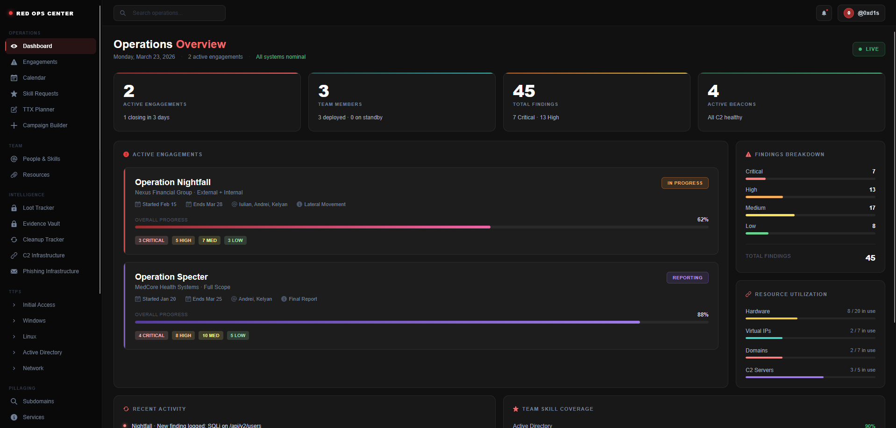

# Red Team Operations Center

A platform that helps red team operators build structure, planning, and execution workflows for continuous campaign preparedness and mission excellence.

---

## Running the App

**Terminal 1 — Backend:**
```bash
cd server
npm run dev
```

**Terminal 2 — Frontend:**
```bash
npm start
```

> Make sure MongoDB is running locally on port `27017` before starting the server.

---

## Dashboard Preview



The dashboard is only accessible to authenticated operators. Unauthenticated requests to `/dashboard/*` are redirected to `/signin` automatically.

---

## Dashboard

### Layout

The dashboard uses a persistent full-screen layout with a fixed left sidebar and a scrollable content area:

```
┌─────────────┬──────────────────────────────────────────┐
│             │  TopBar (@callsign · search · bell)       │
│   Sidebar   ├──────────────────────────────────────────┤
│             │                                          │
│  OPERATIONS │           Active View                    │
│  TEAM       │    (DashboardView / PlaceholderView)     │
│  INTELLIGENCE│                                         │
│  TTPs       │                                          │
│  PILLAGING  │                                          │
│  REPORTING  │                                          │
│             │                                          │
│  Settings   │                                          │
│  Sign Out   │                                          │
└─────────────┴──────────────────────────────────────────┘
```

### Sidebar Navigation

| Section | Items |
|---|---|
| **OPERATIONS** | Dashboard, Engagements, Calendar, Skill Requests, TTX Planner, Campaign Builder |
| **TEAM** | People & Skills, Resources |
| **INTELLIGENCE** | Loot Tracker, Evidence Vault, Cleanup Tracker, C2 Infrastructure, Phishing Infrastructure |
| **TTPs** | Initial Access, Windows, Linux, Active Directory, Network |
| **PILLAGING** | Subdomains, Services, Leaks, Credentials, Emails, Documents |
| **REPORTING** | Reports, Findings, Client Portal |

- Active item is highlighted with a red left border + red tinted background
- Section labels are uppercase in muted gray
- Brand mark "Red Ops Center" with pulsing red dot at top
- Settings + Sign Out pinned at the bottom

### TopBar

- **Search** — operations search input (left)
- **Bell** — notification icon with red dot indicator (right)
- **@callsign chip** — shows the logged-in operator's callsign with avatar initial (right)

### Dashboard Overview (`/dashboard`)

**Stat Cards (top row):**

| Card | Value | Accent |
|---|---|---|
| Active Engagements | 2 | Red gradient |
| Team Members | 3 | Teal gradient |
| Total Findings | 45 | Orange/yellow gradient |
| Active Beacons | 4 | Green gradient |

**Active Engagements panel** — each operation card shows:
- Operation name + client + scope
- Started / Ends dates · Operators · Current phase
- Overall progress bar (color varies by status)
- Status badge: `IN PROGRESS` (orange) · `REPORTING` (purple) · `PLANNING` (blue) · `COMPLETED` (green)
- Severity badges: `CRITICAL` · `HIGH` · `MED` · `LOW`
- Colored left border (red = active, purple = reporting)

**Findings Breakdown panel** — horizontal bars per severity (Critical / High / Medium / Low) + total count

**Resource Utilization panel** — progress bars for Hardware · Virtual IPs · Domains · C2 Servers (used / total)

**Recent Activity feed** — timestamped events with colored dot indicators per type (finding / beacon / milestone / report / phishing)

**Team Skill Coverage** — skill bars with color thresholds (green ≥80% · yellow ≥65% · orange <65%)

### Dashboard Routes

All routes under `/dashboard/*` are protected — unauthenticated users are redirected to `/signin`.

| Path | View | Status |
|---|---|---|
| `/dashboard` | Operations Overview | Built |
| `/dashboard/engagements` | Engagements | Placeholder |
| `/dashboard/calendar` | Calendar | Placeholder |
| `/dashboard/skill-requests` | Skill Requests | Placeholder |
| `/dashboard/ttx` | TTX Planner | Placeholder |
| `/dashboard/campaign` | Campaign Builder | Placeholder |
| `/dashboard/people` | People & Skills | Placeholder |
| `/dashboard/resources` | Resources | Placeholder |
| `/dashboard/loot` | Loot Tracker | Placeholder |
| `/dashboard/evidence` | Evidence Vault | Placeholder |
| `/dashboard/cleanup` | Cleanup Tracker | Placeholder |
| `/dashboard/c2` | C2 Infrastructure | Placeholder |
| `/dashboard/phishing` | Phishing Infrastructure | Placeholder |
| `/dashboard/ttps/initial-access` | Initial Access TTPs | Placeholder |
| `/dashboard/ttps/windows` | Windows TTPs | Placeholder |
| `/dashboard/ttps/linux` | Linux TTPs | Placeholder |
| `/dashboard/ttps/active-directory` | Active Directory TTPs | Placeholder |
| `/dashboard/ttps/network` | Network TTPs | Placeholder |
| `/dashboard/pillaging/subdomains` | Subdomains | Placeholder |
| `/dashboard/pillaging/services` | Services | Placeholder |
| `/dashboard/pillaging/leaks` | Leaks | Placeholder |
| `/dashboard/pillaging/credentials` | Credentials | Placeholder |
| `/dashboard/pillaging/emails` | Emails | Placeholder |
| `/dashboard/pillaging/documents` | Documents | Placeholder |
| `/dashboard/reports` | Reports | Placeholder |
| `/dashboard/findings` | Findings | Placeholder |
| `/dashboard/client-portal` | Client Portal | Placeholder |

### Dashboard File Structure

```
src/components/dashboard/
├── DashboardLayout.js              # Full-screen layout — sidebar + topbar + nested routes
├── Sidebar.js                      # Left nav — 6 sections, active state, sign out
├── TopBar.js                       # Search + notifications + @callsign chip
├── views/
│   ├── DashboardView.js            # Operations Overview — stat cards + all widgets
│   └── PlaceholderView.js          # Reusable "coming soon" view for unbuilt modules
└── widgets/
    ├── StatCard.js                 # Colored-accent stat card (value + label + sub)
    ├── EngagementCard.js           # Individual operation card with progress + findings
    ├── ActiveEngagements.js        # Panel of EngagementCards
    ├── FindingsBreakdown.js        # Severity bar chart + total
    ├── ResourceUtilization.js      # Resource bars (hardware / IPs / domains / C2)
    ├── RecentActivity.js           # Timestamped activity feed with colored dots
    └── TeamSkillCoverage.js        # Skill coverage bars with color thresholds
```

---

## Project Structure

```
red-team-operations-center/
├── docs/                               # Documentation assets (screenshots etc.)
├── server/                             # Node.js + Express backend
│   ├── index.js                        # Entry point — CORS, JSON, route mounts
│   ├── .env                            # Environment variables (never commit)
│   ├── config/
│   │   └── db.js                       # Mongoose connection to MongoDB
│   ├── models/
│   │   └── User.js                     # User schema — callsign, email, password (hashed), role
│   ├── controllers/
│   │   └── authController.js           # register(), login() business logic
│   ├── routes/
│   │   └── auth.js                     # POST /api/auth/register, POST /api/auth/login
│   ├── middleware/
│   │   ├── validate.js                 # express-validator input rules per route
│   │   └── authMiddleware.js           # protect() — JWT verification for protected routes
│   └── utils/
│       └── token.js                    # signToken(), verifyToken() helpers
│
└── src/                                # React frontend
    ├── App.js                          # ChakraProvider + AnimatePresence + Routes
    ├── theme.js                        # Chakra UI dark theme (Inter font, #111111 bg)
    ├── index.js                        # React DOM entry point
    ├── styles/
    │   └── cardStyles.js               # Shared commonCard style object
    ├── contexts/
    │   └── AuthContext.js              # Auth state — fetch-based login/register, JWT, session restore
    └── components/
        ├── common/
        │   ├── Navigation.js           # Frosted-glass nav bar, route-aware active state
        │   ├── PageLayout.js           # Shared wrapper for static pages
        │   └── SparkleQuote.js         # Hover sparkle animation component
        ├── auth/
        │   └── AuthForm.js             # Sign in / Register form with AnimatePresence transition
        ├── dashboard/
        │   ├── DashboardLayout.js      # Full-screen layout — sidebar + topbar + routes
        │   ├── Sidebar.js              # Left nav with 6 sections
        │   ├── TopBar.js               # Search + bell + @callsign
        │   ├── views/
        │   │   ├── DashboardView.js    # Operations Overview page
        │   │   └── PlaceholderView.js  # Reusable placeholder for unbuilt modules
        │   └── widgets/
        │       ├── StatCard.js
        │       ├── EngagementCard.js
        │       ├── ActiveEngagements.js
        │       ├── FindingsBreakdown.js
        │       ├── ResourceUtilization.js
        │       ├── RecentActivity.js
        │       └── TeamSkillCoverage.js
        └── pages/
            ├── LandingLayout.js        # Landing page orchestrator (hero + auth panel)
            ├── LandingHero.js          # Left-side hero — title, tags, sparkle quote
            ├── LandingShapes.js        # 31 scattered decorative shapes
            ├── About.js                # About page orchestrator
            ├── Operators.js            # Operators page orchestrator + team data array
            ├── Certifications.js       # Certifications page orchestrator + cert data array
            ├── about/
            │   ├── AboutIntro.js
            │   ├── StrategicFramework.js
            │   ├── FeatureGrid.js
            │   └── AboutShapes.js
            ├── operators/
            │   ├── OperatorsIntro.js
            │   ├── OperatorCard.js
            │   └── OperatorShapes.js
            └── certifications/
                ├── CertificationsIntro.js
                ├── CertCard.js
                ├── CertShapes.js
                └── ImprovementSection.js
```

---

## Routes

### Frontend (Public)

| Path              | Component                        | Auth required |
|-------------------|----------------------------------|---------------|
| `/`               | Redirects based on auth state    | —             |
| `/signin`         | `LandingLayout` + `AuthForm`     | No            |
| `/register`       | `LandingLayout` + `AuthForm`     | No            |
| `/about`          | `About`                          | No            |
| `/operators`      | `Operators`                      | No            |
| `/certifications` | `Certifications`                 | No            |
| `/dashboard/*`    | `DashboardLayout`                | **Yes**       |

- Logged-in users visiting `/signin` or `/register` are redirected to `/dashboard`
- Unauthenticated users visiting any `/dashboard/*` route are redirected to `/signin`
- Page transitions use `AnimatePresence mode="wait"` on public routes only

### Backend API

| Method | Endpoint              | Body                             | Description              |
|--------|-----------------------|----------------------------------|--------------------------|
| POST   | `/api/auth/register`  | `callsign, email, password`      | Create a new operator    |
| POST   | `/api/auth/login`     | `email, password`                | Login, returns JWT       |
| GET    | `/api/health`         | —                                | Server health check      |

All responses return `{ message }`. Login also returns `{ token, user }`.

---

## Auth Flow

```
Register
  → validate input (express-validator)
  → check email not already taken
  → hash password (bcrypt, 12 rounds)
  → save User to MongoDB
  → return success message → redirect to /signin

Login
  → validate input
  → find user by email (with password field)
  → compare password (bcrypt)
  → sign JWT (7 day expiry)
  → return { token, user }

Frontend session
  → stores JWT + user object in localStorage
  → restores session on page refresh (useEffect on mount)
  → sends Authorization: Bearer <token> header on protected requests
  → logout clears localStorage and resets auth state
```

---

## Database

- **MongoDB** — `red-team-ops-center` database, `users` collection
- **Mongoose** schema with pre-save hook for password hashing
- Password field is excluded from all queries by default (`select: false`)

### User Schema

| Field      | Type   | Required | Notes                         |
|------------|--------|----------|-------------------------------|
| callsign   | String | Yes      | Operator display name         |
| email      | String | Yes      | Unique, lowercase, trimmed    |
| password   | String | Yes      | bcrypt hashed, never returned |
| role       | String | No       | `operator` (default), `admin` |
| createdAt  | Date   | Auto     | Mongoose timestamp            |
| updatedAt  | Date   | Auto     | Mongoose timestamp            |

---

## Environment Variables

Create `server/.env` (already gitignored):

```env
PORT=5000
MONGODB_URI=mongodb://localhost:27017/red-team-ops-center
JWT_SECRET=change_this_to_a_long_random_string_in_production
JWT_EXPIRES_IN=7d
```

---

## Tech Stack

### Frontend
| Package          | Version | Purpose                           |
|------------------|---------|-----------------------------------|
| React            | 18      | Component-based UI                |
| Chakra UI        | ^2.8    | Dark-theme component library      |
| Framer Motion    | ^11.3   | Page + card transitions, sparkles |
| React Router     | v6      | Client-side routing               |
| @chakra-ui/icons | ^2.0    | UI icons throughout               |

### Backend
| Package           | Version | Purpose                          |
|-------------------|---------|----------------------------------|
| Express           | ^4.19   | HTTP server + routing            |
| Mongoose          | ^8.5    | MongoDB ODM + schema validation  |
| bcryptjs          | ^2.4    | Password hashing (12 rounds)     |
| jsonwebtoken      | ^9.0    | JWT sign + verify                |
| express-validator | ^7.1    | Input validation middleware      |
| cors              | ^2.8    | Cross-origin requests from React |
| dotenv            | ^16.4   | Environment variable loading     |
| nodemon           | ^3.1    | Auto-restart on file change      |

---

## Static Assets

```
public/
├── badges/     # Cert badge images — oscp.png, crto.png, cadpenx.png ...
└── images/     # General images — splash.jpg ...

docs/
└── dashboard-preview.png   # Dashboard screenshot (save here manually)
```

---

## Developer Guides

### Adding a New Dashboard Module

1. Create the view in `src/components/dashboard/views/`
2. Add a `<Route>` in [DashboardLayout.js](src/components/dashboard/DashboardLayout.js)
3. Add a nav item in [Sidebar.js](src/components/dashboard/Sidebar.js) under the appropriate section

### Adding a New Widget to the Overview

1. Create the widget in `src/components/dashboard/widgets/`
2. Import and place it in [DashboardView.js](src/components/dashboard/views/DashboardView.js)

### Adding a New Public Page

1. Create your page component in `src/components/pages/`
2. Add a `<Route>` in [App.js](src/App.js)
3. Add a nav item in [Navigation.js](src/components/common/Navigation.js)

### Adding a New API Route

1. Create a controller in `server/controllers/`
2. Create a route file in `server/routes/`
3. Mount it in [server/index.js](server/index.js)
4. Use `protect` middleware for authenticated endpoints:
   ```js
   const { protect } = require('../middleware/authMiddleware');
   router.get('/me', protect, getMe);
   ```

### Shared Card Style

```js
import { commonCard } from '../../styles/cardStyles';
```

### Decorative Side Shapes (Public Pages)

- Container: `pos="absolute" top="0" bottom="0"` — full page height automatically
- Shapes: positioned at `top: X%` inside container
- Right side mirrors left via `ml: 110 - s.ml`
- Only visible on `xl` screens
- Color: `rgba(252,129,129, ...)` — `red.200` at varying opacities
